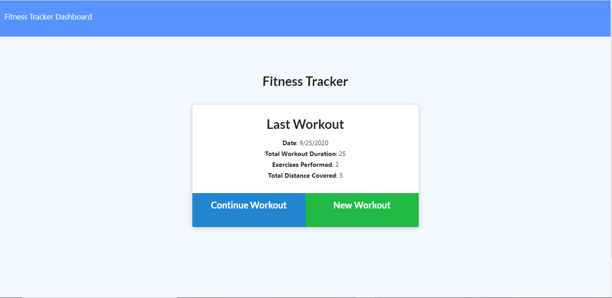
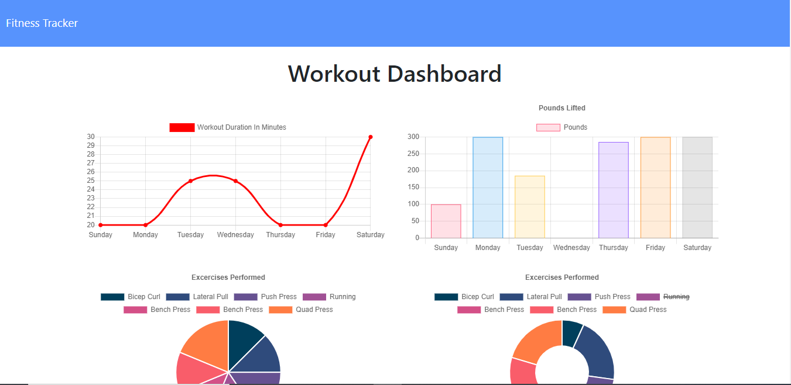

#   workout-tracker
 # workout-tracker

 This app allows a user to create a workout and record the type of workout (cardio or weights) then it allows you to record the duration and distance (cardio) and the weight reps and sets (weights) then it tracks your progress over the course of a week and displays the stats.
 
 ## Table of Contents
 * [Installation](#Installation)
 * [Usage](#Usage)
 * [License](#License)
 * [Contributing](#Contributing)
 * [Tests](#Tests)
 * [Questions](#Questions)
 
 
 ## Installation
 
 > npm i 
 
 
 ## Usage
 
 > 
 
 
 ## License
 [MIT]  This project is covered by the MIT license
 
 ## Contributing
 none 
 
 ## Tests
 

 ## Questions
 for any questions visit my GitHub [sharkattack182](https://github.com/sharkattack182).
 or email me at matthewdc182@gmail.com.
 
 ## Links
 [Github](https://github.com/sharkattack182/workout-tracker)
 [deployed](https://serene-hollows-52003.herokuapp.com/?id=5f6c17698612e400175f7619)
 
 ## Visuals
 
 
 
